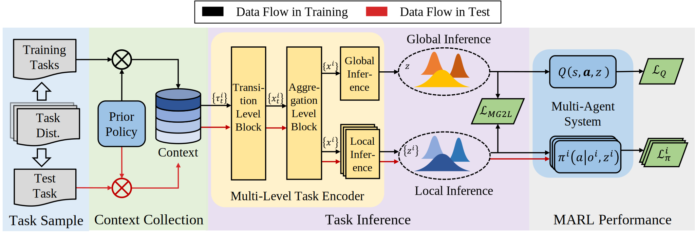
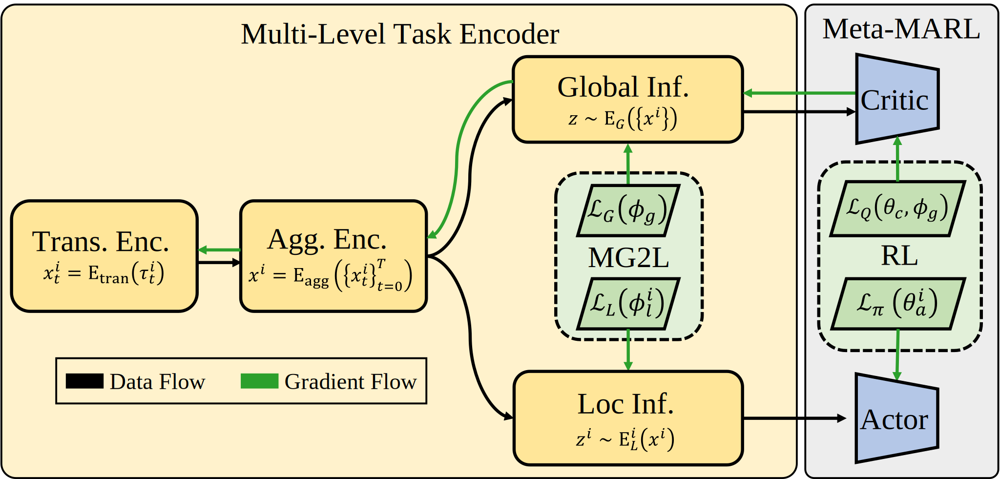
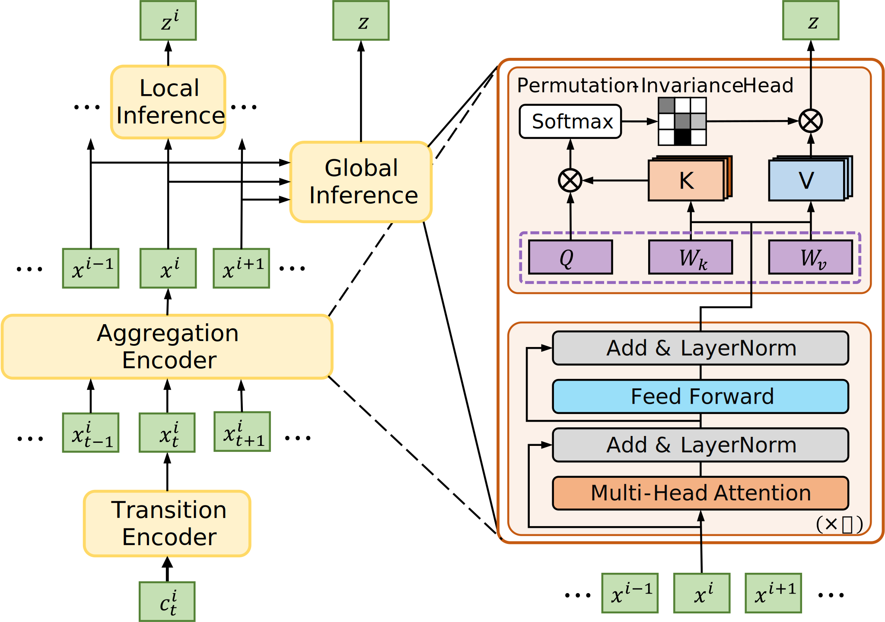

# MG2L: Meta Multi-Agent Reinforcement Learning

This repository is the implementation of the paper 
"Meta Learning Task Representation in Multi-Agent Reinforcement Learning: 
from Global Inference to Local Inference."


## Overview

[//]: # (In Meta-MARL, the challenge of partial observability hinders efficient task inference based on individual local experiences.)

[//]: # (To address this challenge, we present MG2L,)

[//]: # (a novel algorithm with a Mutual Information &#40;MI&#41; optimization-based Global-to-Local training scheme.)

[//]: # (We introduce a multi-level task encoder to perform global and local inference.)

[//]: # (For global, the MAS learns a centralized global representation)

[//]: # (by maximizing MI between the representation and the task.)

[//]: # (For local inference, we define the conditional MI reduction)

[//]: # (to evaluate the global-to-local information gap.)

[//]: # (Agents learn the local representation by minimizing this reduction to enhance the utilization of global context.)

[//]: # (MG2L scheme can serve as a versatile solution for meta-MARL.)




<div style="display: flex; justify-content: space-around;">
    
    
</div>


## Installation
The source code of MAMujoCo and MPE has been included in this repository, 
but you still need to install OpenAI gym, mujoco-py, rware and MAgent support.


```bash
conda create -n mg2l python=3.8
conda activate mg2l
pip install gym==0.21.0 mujoco_py==2.1.2.14 omegaconf rware==1.0.3
```


## Run experiments

You can run the experiments by the following command:

```bash
python train.py --expt=default --algo=mg2l --env=mujoco-cheetah-dir gpu_id=0
```
The `--env` flag can be followed with any existing config name in the `mg2l/config/algo_config/` directory, 
and any other config named `xx` (such as `gpu_id`) can be passed by `xx=value`. 


## Citation


