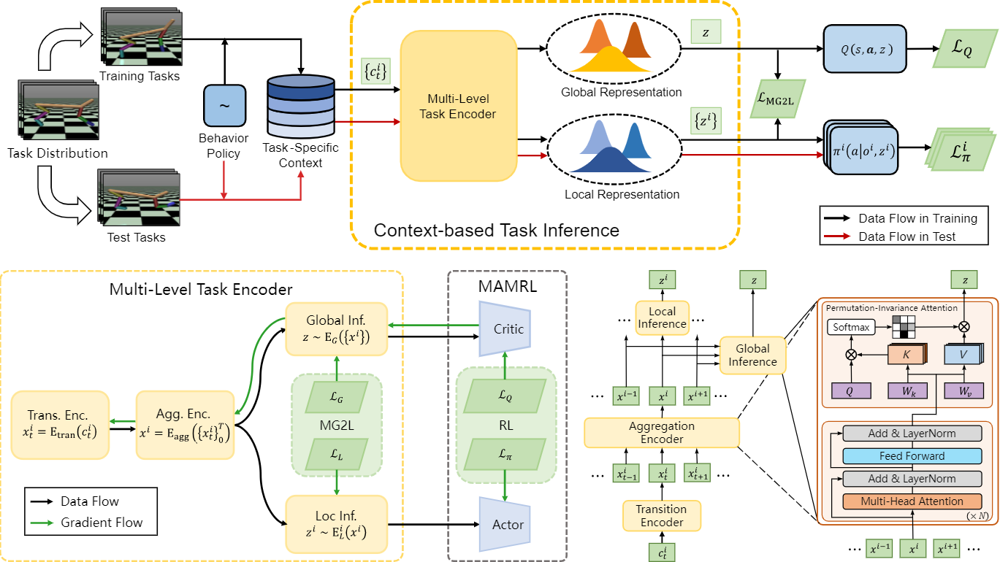
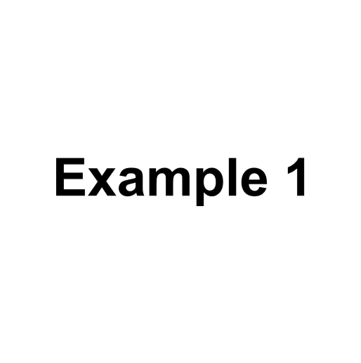
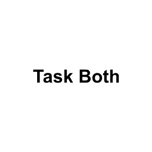
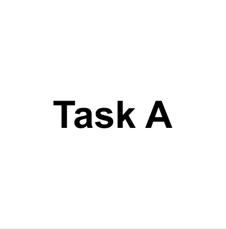

# MG2L: Meta Multi-Agent Reinforcement Learning

This repository is the implementation of the paper 
[Meta Learning Task Representation in Multi-Agent Reinforcement Learning: 
from Global Inference to Local Inference](https://ieeexplore.ieee.org/abstract/document/10905042/).


## Overview

We propose **MG2L**, a mutual-information-based Global-to-Local training scheme with a multi-level task encoder. A centralized global representation is learned by maximizing MI with the task, while agents minimize conditional MI reduction to align local representations with global context. MG2L provides a versatile solution for meta-MARL.



---
## ⚙️ Installation
The source code of [MAMujoCo](https://github.com/schroederdewitt/multiagent_mujoco) and [MPE](https://github.com/openai/multiagent-particle-envs) has been included in this repository, 
but you still need to install [OpenAI gym](https://github.com/openai/gym), [mujoco-py](https://github.com/openai/mujoco-py), [RWARE](https://github.com/semitable/robotic-warehouse) and [MAgent](https://github.com/geek-ai/MAgent) support.

```bash
conda create -n mg2l python=3.8
conda activate mg2l
pip install gym==0.21.0 mujoco_py==2.1.2.14 omegaconf rware==1.0.3
```
---
## 🚀 Quick Start
You can run the experiments by the following command:

```bash
python train.py --expt=default --algo=mg2l --env=mujoco-cheetah-dir gpu_id=0
```
The `--env` flag can be followed with any existing config name in the `mg2l/config/algo_config/` directory, 
and any other config named `xx` (such as `gpu_id`) can be passed by `xx=value`. 

---
## Demos
<p align="center">
    
    
    
    
</p>

---
## 🙏 Acknowledgement & 📜 Citation
Our code is built upon [MAPPO](https://github.com/marlbenchmark/on-policy) and [MATE](https://github.com/uoe-agents/MATE). We thank all these authors for their nicely open sourced code and their great contributions to the community.

```bibtex
@article{zhao2025mg2l,
  author={Zhao, Zijie and Fu, Yuqian and Chai, Jiajun and Zhu, Yuanheng and Zhao, Dongbin},
  journal={IEEE Transactions on Neural Networks and Learning Systems}, 
  title={Meta Learning Task Representation in Multiagent Reinforcement Learning: From Global Inference to Local Inference}, 
  year={2025},
  volume={36},
  number={8},
  pages={14908-14921}
}
```


